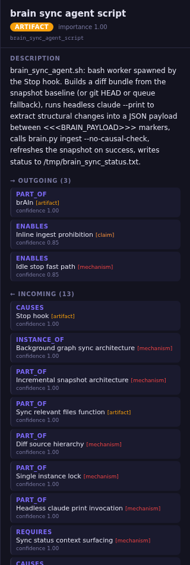

<div align="center">

# brAIn

**Causal memory for Claude — store structure, not text.**

[](https://www.python.org/downloads/)
[](LICENSE)
[](https://kuzudb.com)
[](https://claude.ai/code)

A persistent knowledge graph that Claude maintains automatically.
Instead of re-reading your project's docs every session, Claude extracts
the **causal structure** once and queries it on demand.


</div>

## Why brAIn

| | RAG / vector store | brAIn |
|---|---|---|
| **Stores** | Chunks of source text | Typed nodes + causal edges |
| **Retrieves** | Paragraphs similar to the query | Reasoning chains (`A causes B because Z`) |
| **Answers "why?"** | Returns text near the question | Walks the upstream causal subgraph |
| **Source after ingest** | Still needed | Disposable — the graph carries the structure |

brAIn doesn't compete with RAG — it **answers a different question**.
RAG asks *"what did the text say about X?"*. brAIn asks *"why does X
happen, what enables it, what blocks it?"*. Both can coexist.

## Install

```bash
git clone git@github.com:SilenceKatharos/brAIn.git
cd brAIn
./install.sh
```

`install.sh` is idempotent: creates the venv, installs deps, initializes
Kuzu, ingests `examples/sample.json`, prints the snippets to add to
`~/.claude/settings.json` for the MCP server + 4 hooks, wires the
global `brain` CLI shim.

## First taste

```bash
brain stats
# 18 nodes, 26 rels (the bundled sample on OSS project mortality)

brain causes project_death
# Upstream chain leading to project_death
# -- level 1 --
#   no_release_in_year (event) --[causes c=0.90]--> project_death (event)
#       « Project considered dead after 12 months without release »
#   users_lose_trust (event) --[causes c=0.85]--> project_death (event)
# -- level 2 --
#   bus_factor_of_one (claim) --[causes c=0.80]--> no_release_in_year ...
```

## Anatomy of a node

Every node in the graph carries the same five things, whether you query
it via `brain show <id>` or click it in the UI. Here's what the UI's
detail panel looks like for one of brAIn's own nodes:

<div align="center">



</div>

| Section | What it contains |
|---|---|
| **Header** | Human-readable `label`, `type` badge (color-coded), `importance` score (0.0 → 1.0), canonical `id` (always `slugify(label)`) |
| **Description** | One self-contained sentence written at extraction time. The contract: this description must be rich enough that the source document could be **deleted** without losing the concept's meaning. |
| **→ Outgoing edges** | What this node leads to: relation type (`PART_OF`, `ENABLES`, `CAUSES`...), the target node + its type, the **evidence sentence** explaining *why* this edge exists, and the `confidence` (0.0 → 1.0). |
| **← Incoming edges** | What leads to this node: same structure as outgoing, reversed direction. |
| (implicit) `sources` | The list of doc_ids and `project:<name>` tags that contributed this node — visible in `brain show` output and queryable via Cypher. |

**The evidence sentence is the load-bearing part.** `brain causes` and
`brain paths` use these sentences to explain *why* a chain exists, not
just *that* it exists. A weak `evidence` ("yes", "because", "linked")
makes the graph a directory; a rich one makes it a memory.

## How it works

```
┌───────────────────────────────────────────────────────────┐
│  YOU + CLAUDE CODE                                        │
│  ─────────────────                                        │
│  edit files, ask "why is X this way?"                     │
└──────┬──────────────────────────────────┬─────────────────┘
       │ Edit/Write fires hook            │ asks design questions
       ▼                                  ▼
┌──────────────────────┐         ┌──────────────────────────┐
│  Hooks (4)           │         │  10 MCP tools            │
│  queue file paths    │         │  brain_find / brain_show │
│  inject reminders    │         │  brain_causes / paths …  │
└──────┬───────────────┘         └──────────────┬───────────┘
       │ on Stop                                │ Cypher
       ▼                                        │ on demand
┌──────────────────────────┐                    ▼
│  brain_sync_agent.sh     │         ┌──────────────────────┐
│  (background, headless)  │ ingests │  Kuzu causal graph   │
│  · git diff vs snapshot  │────────►│  /graph/kuzu_db/     │
│  · claude --print extract│         └──────────────────────┘
│  · brain check + ingest  │
└──────────────────────────┘
```

**Two roles, two processes.** The foreground session you talk to only
**queries**. A background **sync agent** spawned at every Stop diffs the
project, extracts structural changes, and writes to the graph. Neither
competes with the other.

## Features

- **Auto-register any git repo.** Open Claude Code in a project, the
  SessionStart hook detects it and starts tracking — no setup command.
- **Background sync agent.** Maintains the graph at every Stop without
  blocking your session. Per-project incremental snapshots; idle Stops
  exit in <100 ms with zero API call.
- **10 MCP tools** (`brain_find`, `brain_show`, `brain_causes`,
  `brain_effects`, `brain_paths`, `brain_query`, `brain_stats`,
  `brain_audit`, `brain_check`, `brain_ingest`) available in every
  Claude Code session.
- **Strict causal vocabulary.** 12 typed relations, the validator
  rejects anything else. Open node types for flexibility.
- **Per-message reminder** keeps the graph-first protocol fresh across
  long conversations.
- **Idempotent re-ingestion.** Re-running on the same `doc_id` purges
  and replaces cleanly; nodes are never lost.

## Cost

The background sync agent calls `claude --print` once per Stop with
file changes. On idle Stops it exits in <100 ms with no API call. On
real edits it sends only the per-turn delta (typical ~2 KB) — measured
~96% token reduction vs. re-sending the full session diff.

## Documentation

| Doc | What's inside |
|---|---|
| [Architecture](docs/ARCHITECTURE.md) | Hooks, sync agent, multi-project state, recursion guards |
| [CLI reference](docs/CLI.md) | All 15 commands with flags and examples |
| [Ingestion](docs/INGESTION.md) | Payload format, slug rules, idempotency, validation |
| [Vocabulary](docs/VOCABULARY.md) | Relation types, node types, confidence calibration |
| [Schema](docs/SCHEMA.md) | Kuzu DDL, parallel arrays invariant |
| [UI](docs/UI.md) | React explorer + autonomous ingest panel |
| [Skill (extraction protocol)](docs/SKILL.md) | The protocol used by the sync agent and `/ingest` |
| [Limitations](docs/LIMITATIONS.md) | Known gaps and workarounds |

## Project layout

```
brAIn/
├── install.sh             one-command installer
├── brain.py               CLI entrypoint
├── mcp_server.py          MCP server (10 tools)
├── brain_*.sh / .py       4 Claude Code hooks (see Architecture)
├── brain_sync_agent.sh    background graph sync worker
├── lib/                   engine (db, validate, ingest, check, audit, …)
├── docs/                  detailed documentation
├── ui/                    React explorer (backend + frontend)
├── examples/sample.json   18-node reference extraction
├── projects/              per-project ingestion payloads
└── tests/                 pytest suite
```

## License

MIT — see [`LICENSE`](LICENSE).
