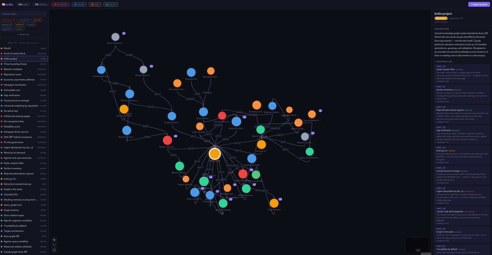
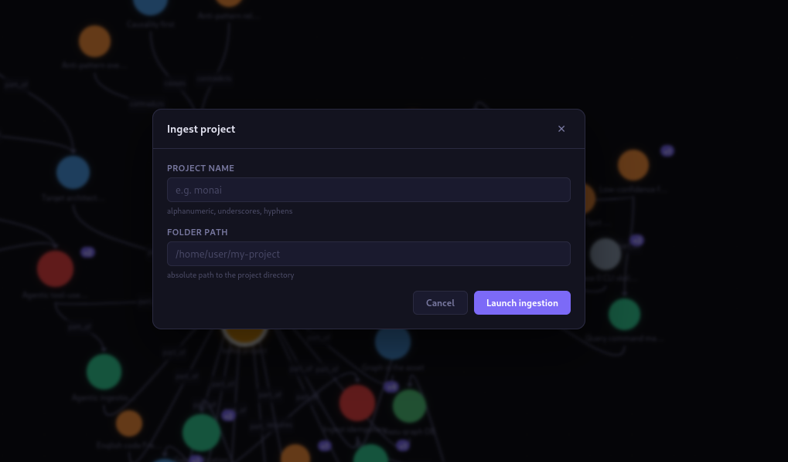

# brAIn

**A causal knowledge graph built for [Claude](https://claude.ai/code): store structure, not text.**

brAIn is a persistent external memory for Claude. Instead of re-reading documents every session, Claude extracts their causal structure once and stores it as a graph of atomic claims linked by typed edges (`causes`, `prevents`, `requires`, `enables`). Future sessions query the graph directly — no re-reading, no re-summarizing, no lost context.

**brAIn contains zero LLM calls inside `lib/`.** There are no AI libraries or NLP parsers. The intelligence lives entirely in Claude. `brain.py` is pure plumbing: validation, deduplication, Cypher queries, persistence.

The graph is the asset. The code is replaceable.

| Approach | What's stored | What's retrieved |
|---|---|---|
| RAG / vector DB | Chunks of source text | Paragraphs that match the query |
| brAIn | Causal structure extracted from text | Nodes + typed evidence chains |



## How it works

You point Claude at a document. Claude reads it, extracts nodes and causal relations, and emits a structured JSON payload. `brain.py` ingests it into a local [Kuzu](https://kuzudb.com) graph database. In any future session, Claude calls one of the 8 MCP tools to fetch only the neighborhood of the concept it needs — never the whole graph.

**Design invariant:** after a complete ingestion, you should be able to delete the source document and keep reasoning. If you cannot, the extraction was incomplete. This is the correctness criterion for extraction quality.

## Features

- **Claude Code integration**: MCP server (`mcp_server.py`) with 8 graph tools available in every session; skill manifest (`docs/SKILL.md`) for full extraction protocol
- **CLI** (`brain.py`): `init`, `ingest`, `find`, `show`, `causes`, `effects`, `paths`, `query`, `stats`, `audit`, `export`, `import`, `merge`, `context`
- **React UI**: interactive graph explorer, search + type filters, node detail panel, autonomous project ingestion via a dedicated Claude session
- **Kuzu embedded graph DB**: Cypher queries, no server, no cloud, local storage in `graph/kuzu_db/`
- **Idempotent re-ingestion**: re-running `ingest` on an existing `doc_id` purges and replaces its contributions cleanly; nodes are never deleted
- **Typed vocabulary**: strict relation whitelist (12 types), open node types (any string accepted)
- **Claude Code hooks**: PostToolUse + Stop hooks enforce graph updates after file edits in the same session

## Quick start

**Requirements:** Python ≥ 3.10, Node 18+ (UI only).

```bash
git clone git@github.com:SilenceKatharos/brAIn.git
cd brAIn
python3 -m venv .venv
.venv/bin/pip install kuzu click

.venv/bin/python brain.py init
.venv/bin/python brain.py ingest examples/sample.json

.venv/bin/python brain.py stats
.venv/bin/python brain.py effects bus_factor_of_one
.venv/bin/python brain.py paths bus_factor_of_one project_death
```

**Optional: global `brain` command.**

```bash
cat > ~/.local/bin/brain << 'EOF'
#!/usr/bin/env bash
exec /absolute/path/to/brAIn/.venv/bin/python /absolute/path/to/brAIn/brain.py "$@"
EOF
chmod +x ~/.local/bin/brain

brain stats
brain find redis
brain effects cache_miss_storm
```

## Using with Claude Code

### As an MCP server (recommended)

Registers 8 graph tools in **every** Claude Code session, regardless of working directory.

```bash
realpath .   # run from inside the brAIn directory
```

Add to `~/.claude/settings.json`:

```json
{
  "mcpServers": {
    "brain": {
      "command": "/absolute/path/to/brAIn/.venv/bin/python",
      "args": ["/absolute/path/to/brAIn/mcp_server.py"]
    }
  }
}
```

Available tools: `brain_find`, `brain_show`, `brain_causes`, `brain_effects`, `brain_paths`, `brain_query`, `brain_stats`, `brain_ingest`.

**On-demand retrieval**: Claude never loads the whole graph into context. It fetches only the 1-hop neighborhood of the concept it is currently processing.

### As a skill

Add to `.claude/CLAUDE.md` in any project:

```
@/absolute/path/to/brAIn/docs/SKILL.md
```

Claude follows a 7-step extraction protocol: section inventory → entity pass (including marked decisions, rejected alternatives, and named sub-components) → relation pass → anti-duplicate check → completeness review → emit payload → gap verification.

### Claude Code hooks (enforce graph sync)

Three hooks keep the graph in sync with active development:

```bash
# brain_session_start.sh  — SessionStart: timestamps session, clears tmp state
# brain_hook.sh           — PostToolUse on Edit/Write: logs modified files,
#                           injects graph-update reminder into Claude's context
# brain_stop_check.py     — Stop: blocks if files were modified but no graph
#                           update detected; escape hatch allows exit on 2nd attempt
```

The Stop hook queries `MATCH (n:Node) WHERE n.updated_at >= $session_start` — if any node was updated, the session is considered graph-synced and the hook allows termination.

## React UI

```bash
# Backend (from the brAIn root)
.venv/bin/pip install fastapi "uvicorn[standard]"
uvicorn ui.backend.main:app --port 8000

# Frontend (separate terminal)
cd ui/frontend
npm install
npm run dev     # → http://localhost:5173
```

The UI is a three-column layout: search/filter/node-list sidebar (left), force-directed graph canvas (center, d3-force layout), node detail panel (right).

**Default view**: the canvas opens with only the highest-importance node visible. Double-clicking any node reveals its 1-hop neighbors. Search and type-filters override this and show their full result set.

**Ingest panel**: enter a project name and folder path; the backend spawns a dedicated Claude session that autonomously reads, extracts, and ingests the project. Coverage includes all file types: `*.md`, `*.py`, `*.jsx`, `*.tsx`, `*.js`, `*.sh`. For code files, the protocol extracts architectural decisions — why a module exists, what it prevents or enables, rejected alternatives — not line-by-line logic. The ingestion job streams output in real time; the frontend polls every 2 seconds.



## CLI reference

```
brain.py init                    Create database and schema (idempotent)
brain.py ingest <file.json>      Ingest payload; safe to re-run on same doc_id
brain.py find <pattern>          Search nodes by label or id substring
brain.py show <node_id>          Print node + incoming/outgoing edges with evidence
brain.py causes <node>           Walk upstream causal chain (causes/requires/enables/precedes)
brain.py effects <node>          Walk downstream causal chain
brain.py paths <src> <dst>       Find all paths up to 4 hops between two nodes
brain.py query "<cypher>"        Run raw Cypher
brain.py stats                   Node/relation counts by type
brain.py audit                   Health report: orphan ratio, related_to ratio, avg confidence, top-degree nodes
brain.py export <file>           Dump full graph to JSON
brain.py import <file>           Load a dump (--strategy force | merge)
brain.py merge SRC INTO DST      Merge node SRC into DST; SRC is deleted
brain.py context <topic>         Get node + neighborhood for a topic (used by MCP)
```

## Ingestion format

```json
{
  "doc_id": "redis_postmortem_2026_q1",
  "nodes": [
    {
      "id": "ttl_too_short",
      "label": "TTL too short",
      "type": "claim",
      "description": "Redis TTL set to 5s for hot keys whose median inter-request interval is 30s.",
      "importance": 0.85
    },
    {
      "id": "cache_miss_storm",
      "label": "Cache miss storm",
      "type": "event",
      "description": "Near-total cache miss rate on hot keys, all reads falling back to the database."
    }
  ],
  "rels": [
    {
      "src": "ttl_too_short",
      "dst": "cache_miss_storm",
      "type": "causes",
      "confidence": 0.95,
      "evidence": "TTL shorter than the mean inter-request interval guarantees expiry between every two accesses."
    }
  ]
}
```

**ID rules:** `id` is canonicalized to `slugify(label)` — lowercase, non-alphanumeric → `_`, max 80 chars. Avoid parentheses, slashes, and dots in labels: `"Reliability sigmoid G(f,d)"` becomes `reliability_sigmoid_g_f_d`, and any relation referencing the pre-rewrite id is **silently skipped**. After ingestion, run `brain find <label>` to confirm the actual id.

**Re-ingestion semantics:** re-ingesting an existing `doc_id` first purges all its contributions (removes from edge sources/evidences, deletes edge if sources becomes empty), then inserts the new payload. Nodes are never deleted.

**Confidence calibration:**

| Value | Meaning |
|---|---|
| `1.0` | Explicitly stated with a direct causal verb |
| `0.7–0.9` | Reasonable inference from the text |
| `0.4–0.6` | Plausible hypothesis, not demonstrated |
| `< 0.4` | Do not ingest — omit rather than pollute |

## Vocabulary

### Relation types (strict whitelist)

Any type outside this list is **rejected** at ingestion and logged to `extension_requests.jsonl`.

| Type | Meaning |
|---|---|
| `causes` | A produces B (factual or statistical) |
| `prevents` | A blocks B |
| `requires` | B cannot exist without A |
| `enables` | A makes B possible without forcing it |
| `precedes` | A happens before B (temporal only) |
| `contradicts` | A and B are logically incompatible |
| `is_a` | A is a kind of B |
| `part_of` | A is a component of B |
| `instance_of` | A is a concrete instance of B |
| `similar_to` | A resembles B without being an instance |
| `property_of` | A is a property of B |
| `related_to` | Unqualified link — avoid, keep below 5% of edges |

### Node types (open vocabulary)

Any non-empty string is accepted. Unknown types are logged to `extension_requests.jsonl` for review. Common types: `concept`, `entity`, `event`, `claim`, `mechanism`, `algorithm`, `property`, `person`, `artifact`, `process`.

## Design principles

1. **The graph is the asset, not the code.** Engineering investment is biased toward graph quality; the code stays simple and replaceable.
2. **One assertion beats one paragraph.** `ttl_too_short –causes→ cache_miss_storm` with a one-sentence `evidence` is more useful than three paragraphs to re-read every session.
3. **Causality first.** Taxonomic relations (`is_a`, `part_of`) are support structure. The semantic core is `causes / prevents / requires / enables`.
4. **Source documents are disposable.** After correct extraction, you should be able to delete the source and keep reasoning. If you can't, the extraction was incomplete.
5. **Traceability by default.** Every node and edge carries `sources` (origin doc_ids) and `evidence` (the reasoning). `evidences[i]` is parallel to `sources[i]`.
6. **On-demand retrieval, not preemptive injection.** Claude never loads the whole graph. It fetches only the 1-hop neighborhood of the concept it needs, via tool calls.

## Testing

```bash
.venv/bin/pytest tests/ -q
.venv/bin/python -m coverage run --source=lib,brain -m pytest tests/ -q
.venv/bin/python -m coverage report
```

## Project layout

```
brAIn/
├── brain.py              # CLI entrypoint (pure plumbing, no semantic logic)
├── mcp_server.py         # MCP server — 8 graph tools for Claude Code
├── brain_hook.sh         # PostToolUse hook (graph-sync enforcement)
├── brain_session_start.sh# SessionStart hook
├── brain_stop_check.py   # Stop hook (blocks exit if graph not updated)
├── lib/                  # Core modules: db, validate, ingest, query, audit, slugify
├── docs/
│   ├── SKILL.md          # Claude extraction protocol (7 steps)
│   └── SCHEMA.md         # Graph schema reference
├── ui/
│   ├── backend/          # FastAPI backend (port 8000)
│   └── frontend/         # React + Vite (port 5173)
├── examples/
│   └── sample.json       # Worked example: open-source project mortality
├── projects/             # Extracted project payloads (by project name)
└── experiments/          # Research scripts: corpus download, extraction comparison
```

## License

MIT, see [`LICENSE`](LICENSE).
